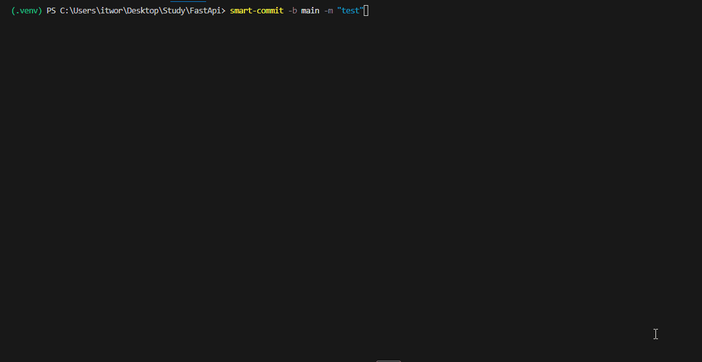

# 🚀 Smart Commit

[English](README.md) | [Русский](README.ru.md)

[](https://pypi.org/project/smart-commit-tool/)
[](https://pypi.org/project/smart-commit-tool/)
[](https://opensource.org/licenses/MIT)
[](https://github.com/mokinprokin/smart_commit/stargazers)

**Smart Commit** is a universal CLI tool designed to streamline and secure your Git workflow. It orchestrates linting, testing, committing, and pushing into a single, bulletproof operation.

**The Golden Rule:** If your tests fail, your code doesn't ship.

---

## ✨ Key Features

* 🌍 **Language Agnostic**: Works seamlessly with Python, JS, Go, Rust, Dart, or any other stack.
* ⚡ **All-in-One Command**: Replaces the tedious `lint -> test -> add -> commit -> push` routine.
* 🛡️ **Branch Protection**: Safeguards your `main`, `master`, or `prod` branches from accidental direct pushes.
* 🔧 **Zero-Setup**: Install via `pip` and configure in under a minute using a single file.

---

## 📦 Installation

```bash
pip install smart-commit-tool

```

> **Note:** Once installed, the tool is available via the simple and concise `smart-commit` command.

---

## 🔧 Configuration (`pyproject.toml`)

Smart Commit leverages `pyproject.toml` for its configuration. Simply create this file in your project root (even if you aren't using Python for your main project).

```toml
[tool.smart_commit]
repository_url = "https://github.com/youruser/yourrepo.git"
protected_branches = ["main", "master", "prod"]

# List any shell commands you want to run BEFORE the push.
# If any command returns a non-zero exit code, the process aborts.
commands = [
    "ruff check .",      # Python Linter
    "pytest -v",         # Python Tests
    "npm run lint",      # Node.js Linter
    "go test ./..."      # Go Tests
]

```

---

## 🚀 Usage

Navigate to your project root (where your `pyproject.toml` is located) and run:

```bash
smart-commit

```

### CLI Arguments

| Flag | Description |
| --- | --- |
| `-b, --branch` | Specify target branch (skips interactive prompt) |
| `-m, --message` | Set commit message (skips interactive prompt) |

---

## 🔄 How It Works (The Algorithm)

1. **Environment Sanity Check**: Verifies Git initialization and remote repository connectivity.
2. **Branch Guard**: If you attempt to push to a protected branch, the tool prompts you to create a new feature branch instead.
3. **Pre-push Validation**: Sequentially executes your defined `commands`. If any step fails, the entire process stops immediately to keep your remote clean.
4. **Optimized Push**: Automatically handles `add` and `commit`. If the remote branch has moved forward, it helps you `rebase` to ensure a linear, clean history.

---


## 📄 License
Distributed under the MIT License. Feel free to use, modify, and share!
